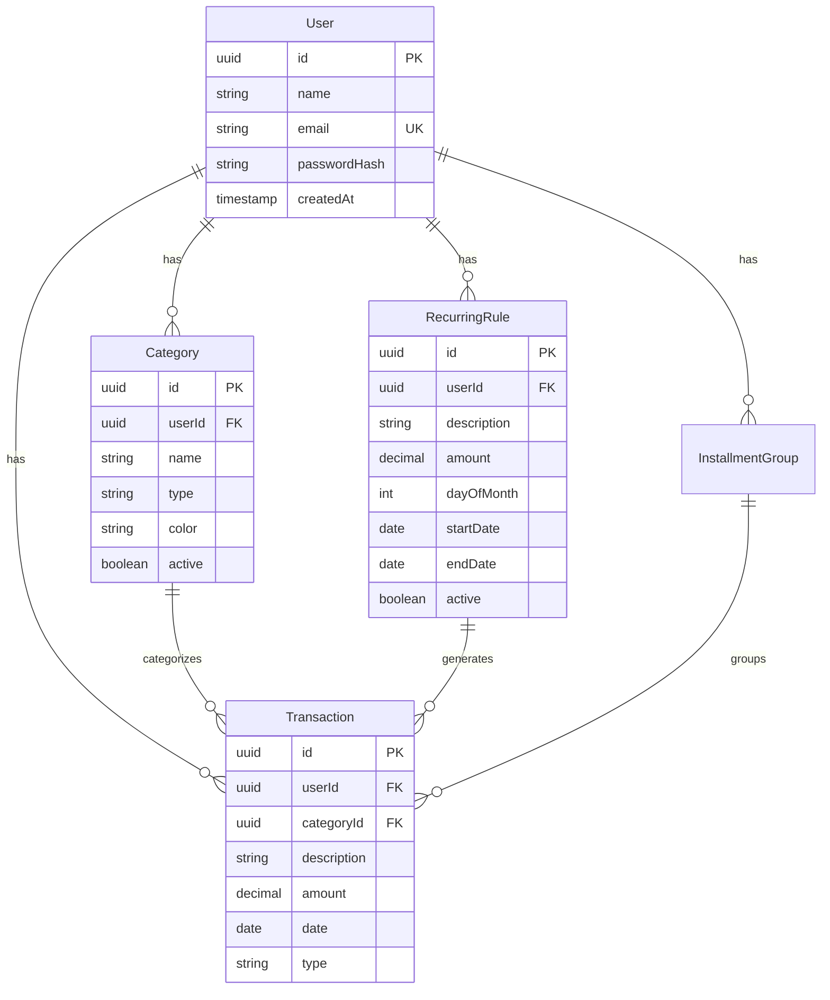

# 💰 FinControl

<div align="center">


**Sistema completo de controle financeiro pessoal com dashboards interativos**

[Funcionalidades](#-funcionalidades) • [Tecnologias](#-tecnologias-utilizadas) • [Instalação](#-instalação) • [Documentação](#-documentação)

</div>

---

## 📖 Sobre o Projeto

FinControl é uma aplicação web moderna e completa para gerenciamento financeiro pessoal. Desenvolvida com as melhores práticas de desenvolvimento, oferece uma interface intuitiva para controle de receitas, despesas, parcelamentos, transações recorrentes e visualização de dados através de dashboards interativos com gráficos e relatórios.

### ✨ Funcionalidades

#### 🔐 Autenticação e Segurança
- Sistema completo de autenticação com JWT
- Registro e login de usuários
- Proteção de rotas e dados por usuário
- Senhas armazenadas com hash seguro

#### 💸 Gestão Financeira
- **Transações Variáveis**: Lançamento de receitas e despesas únicas
- **Transações Recorrentes**: Configuração de receitas/despesas fixas mensais
- **Parcelamentos**: Gestão de compras parceladas com controle de parcelas
- **Categorias Personalizadas**: Criação e gerenciamento de categorias por tipo (receita/despesa)
- **Calendário Financeiro**: Visualização de transações em formato de calendário
- **Histórico Completo**: Registro detalhado de todas as movimentações

#### 📊 Dashboards e Relatórios
- **Visão Geral Financeira**: Resumo de receitas, despesas e saldo
- **Gráficos Interativos**:
  - Gráfico de pizza por categoria
  - Histogramas de gastos mensais
  - Evolução de despesas ao longo do tempo
  - Análise de gastos semanais
- **Transações Recentes**: Últimas movimentações em tempo real
- **Contas a Pagar**: Visualização de próximos vencimentos
- **Dashboard Personalizável**: Reordenação de widgets com drag-and-drop

#### 🎨 Interface e Usabilidade
- Design responsivo e moderno com Tailwind CSS
- Tema claro/escuro com persistência de preferência
- Componentes reutilizáveis e acessíveis
- Feedback visual para ações do usuário
- Modais para CRUD de transações e categorias

---

## 🚀 Tecnologias Utilizadas

### Frontend
| Tecnologia | Descrição |
|-----------|-----------|
|  | Biblioteca JavaScript para interfaces |
|  | Superset tipado do JavaScript |
|  | Build tool ultrarrápido |
|  | Framework CSS utility-first |
|  | Roteamento declarativo |
|  | Gerenciamento de estado assíncrono |
|  | Biblioteca de gráficos em React |
|  | Cliente HTTP |
|  | Ícones modernos |
|  | Drag and drop acessível |

### Backend
| Tecnologia | Descrição |
|-----------|-----------|
|  | Runtime JavaScript server-side |
|  | Superset tipado do JavaScript |
|  | Framework web ultrarrápido |
|  | ORM moderno para Node.js |
|  | Banco de dados relacional |
|  | Validação de schemas TypeScript |
|  | Autenticação stateless |

### Infraestrutura
| Tecnologia | Descrição |
|-----------|-----------|
|  | Containerização da aplicação |
|  | Servidor web e proxy reverso |
|  | Testes de carga e performance |

---


## 🛠️ Instalação

### Pré-requisitos

Certifique-se de ter instalado:
- [Docker](https://docs.docker.com/get-docker/) (versão 20.10 ou superior)
- [Docker Compose](https://docs.docker.com/compose/install/) (versão 2.0 ou superior)
- [Git](https://git-scm.com/downloads)

### Configuração Inicial

1. **Clone o repositório**
   ```bash
   git clone https://github.com/lukagouvea/fincontrol.git
   cd fincontrol
   ```

2. **Configure as variáveis de ambiente**

   **Backend** (`backend/.env`):
   ```bash
   cp backend/.env.example backend/.env
   ```
   
   Edite o arquivo `backend/.env` com suas credenciais:
   ```env
   POSTGRES_USER=seu_usuario
   POSTGRES_PASSWORD=sua_senha_segura
   POSTGRES_DB=fincontrol
   DATABASE_URL=postgresql://seu_usuario:sua_senha@db:5432/fincontrol?schema=public
   FRONTEND_URL=http://localhost:5173
   PORT=3001
   JWT_SECRET=uma_chave_secreta_aleatoria_e_complexa
   ```
   
   > ⚠️ **Importante**: Use credenciais fortes e únicas. Nunca versione o arquivo `.env` no Git.

   **Frontend** (`frontend/.env`):
   ```bash
   cp frontend/.env.example frontend/.env
   ```
   
   Edite o arquivo `frontend/.env`:
   ```env
   VITE_API_URL=/api
   ```

### 🚀 Executando o Projeto

#### Modo Desenvolvimento

Ambiente com **hot reload** habilitado para desenvolvimento ágil:

```bash
docker compose up --build
```

A aplicação estará disponível em:
- 🌐 **Frontend**: http://localhost:5173
- 🔌 **Backend API**: http://localhost:3001
- 🗄️ **PostgreSQL**: localhost:5432

**Recursos do modo desenvolvimento:**
- Hot reload no frontend (Vite)
- Hot reload no backend (tsx watch)
- Volumes montados para edição em tempo real
- Logs detalhados no console

Para parar os containers:
```bash
docker compose down
```

#### Modo Produção

Ambiente otimizado para produção:

```bash
docker compose -f docker-compose.prod.yml up --build -d
```

A aplicação estará disponível em:
- 🌐 **Frontend**: http://localhost (porta 80)
- 🔌 **Backend API**: http://localhost/api

**Otimizações de produção:**
- Build otimizado com assets minificados
- Nginx como servidor web de alto desempenho
- PostgreSQL configurado para VPS com 1GB RAM
- Containers em modo detached (`-d`)

Para visualizar logs:
```bash
docker compose -f docker-compose.prod.yml logs -f
```

Para parar e remover containers:
```bash
docker compose -f docker-compose.prod.yml down
```

### 🔄 Comandos Úteis

```bash
# Ver status dos containers
docker compose ps

# Rebuild apenas um serviço
docker compose up --build backend

# Acessar shell do container do backend
docker compose exec backend sh

# Executar migrações do Prisma
docker compose exec backend npx prisma migrate deploy

# Visualizar logs de um serviço específico
docker compose logs -f frontend

# Limpar volumes (⚠️ remove dados do banco)
docker compose down -v
```

---

## 🧪 Testes de Carga

O projeto inclui scripts de teste de performance usando **k6**, ferramenta open-source para testes de carga.

### Pré-requisitos

Instale o k6:

**Linux:**
```bash
sudo gpg -k
sudo gpg --no-default-keyring --keyring /usr/share/keyrings/k6-archive-keyring.gpg --keyserver hkp://keyserver.ubuntu.com:80 --recv-keys C5AD17C747E3415A3642D57D77C6C491D6AC1D69
echo "deb [signed-by=/usr/share/keyrings/k6-archive-keyring.gpg] https://dl.k6.io/deb stable main" | sudo tee /etc/apt/sources.list.d/k6.list
sudo apt-get update
sudo apt-get install k6
```

**MacOS:**
```bash
brew install k6
```

**Docker:**
```bash
docker pull grafana/k6
```

### Scripts Disponíveis

#### 1. Teste de Carga Geral (`teste_carga.js`)

Simula múltiplos usuários acessando a aplicação simultaneamente.

**Cenário:**
- 30s: Sobe gradualmente para 50 usuários
- 1min: Mantém 50 usuários simultâneos
- 10s: Reduz para 0 (cooldown)

**Executar:**
```bash
k6 run teste_carga.js
```

**Com Docker:**
```bash
docker run --rm -i grafana/k6 run - < teste_carga.js
```

#### 2. Teste de Estresse de Login (`teste_login.js`)

Testa a capacidade do servidor de processar múltiplos logins simultâneos.

**Cenário:**
- 20 usuários tentando fazer login ao mesmo tempo
- Duração: 30 segundos

**Executar:**
```bash
k6 run teste_login.js
```

**Com Docker:**
```bash
docker run --rm -i grafana/k6 run - < teste_login.js
```

### Interpretando Resultados

O k6 fornece métricas como:
- **http_req_duration**: Tempo de resposta das requisições
- **http_req_failed**: Taxa de falhas
- **iterations**: Número de execuções completadas
- **vus (Virtual Users)**: Usuários simultâneos

Exemplo de saída:
```
http_req_duration..............: avg=245ms  min=89ms  med=198ms  max=1.2s
http_req_failed................: 0.00%
iterations.....................: 150
vus............................: 50
```

---

## 📚 Documentação

### Modelo de Dados

O banco de dados utiliza **PostgreSQL** com as seguintes entidades principais:



### API Endpoints

A API segue os padrões REST e todos os endpoints (exceto autenticação) requerem token JWT no header `Authorization: Bearer <token>`.

---

#### 🔐 Autenticação

| Método | Endpoint | Descrição | Autenticação |
|--------|----------|-----------|--------------|
| `POST` | `/api/auth/register` | Criar nova conta de usuário | ❌ Pública |
| `POST` | `/api/auth/login` | Autenticar e obter token JWT | ❌ Pública |
| `GET` | `/api/auth/me` | Obter dados do usuário autenticado | ✅ Requerida |

**Exemplo de Registro:**
```json
POST /api/auth/register
{
  "name": "João Silva",
  "email": "joao@exemplo.com",
  "password": "senha_segura_123"
}
```

---

#### 🏷️ Categorias

| Método | Endpoint | Descrição |
|--------|----------|-----------|
| `GET` | `/api/categories` | Listar todas as categorias do usuário |
| `POST` | `/api/categories` | Criar nova categoria |
| `PUT` | `/api/categories/:id` | Atualizar categoria existente |
| `DELETE` | `/api/categories/:id` | Remover categoria |

**Exemplo:**
```json
POST /api/categories
{
  "name": "Alimentação",
  "type": "expense",
  "color": "#FF6B6B",
  "description": "Gastos com supermercado e restaurantes"
}
```

---

#### 💰 Transações

| Método | Endpoint | Descrição |
|--------|----------|-----------|
| `GET` | `/api/transactions` | Listar transações com filtros opcionais |
| `POST` | `/api/transactions` | Criar nova transação |
| `PUT` | `/api/transactions/:id` | Atualizar transação existente |
| `DELETE` | `/api/transactions/:id` | Remover transação |
| `GET` | `/api/transactions/installments` | Listar grupos de parcelamentos |

**Filtros disponíveis (query params):**
- `type`: `income` ou `expense`
- `startDate` / `endDate`: Filtro por período
- `categoryId`: Filtrar por categoria

**Exemplo:**
```json
POST /api/transactions
{
  "description": "Salário",
  "amount": 5000.00,
  "type": "income",
  "categoryId": "uuid-da-categoria",
  "date": "2025-11-27"
}
```

---

#### 🔄 Transações Recorrentes

| Método | Endpoint | Descrição |
|--------|----------|-----------|
| `GET` | `/api/recurring` | Listar todas as regras recorrentes |
| `POST` | `/api/recurring` | Criar nova regra recorrente |
| `PUT` | `/api/recurring/:id` | Atualizar regra existente |
| `DELETE` | `/api/recurring/:id` | Remover regra recorrente |
| `POST` | `/api/recurring/generate` | Gerar transações do mês atual |

**Exemplo:**
```json
POST /api/recurring
{
  "description": "Aluguel",
  "amount": 1500.00,
  "type": "expense",
  "dayOfMonth": 10,
  "categoryId": "uuid-da-categoria",
  "startDate": "2025-01-01",
  "active": true
}
```

---

#### 📊 Dashboard

| Método | Endpoint | Descrição |
|--------|----------|-----------|
| `GET` | `/api/dashboard/summary` | Resumo financeiro (receitas, despesas, saldo) |
| `GET` | `/api/dashboard/recent` | Últimas 10 transações |
| `GET` | `/api/dashboard/upcoming` | Próximos vencimentos de contas |
| `GET` | `/api/dashboard/category-chart` | Dados agrupados por categoria para gráficos |

**Resposta de exemplo (`/summary`):**
```json
{
  "totalIncome": 8500.00,
  "totalExpenses": 6200.00,
  "balance": 2300.00,
  "period": "2025-11"
}
```

---

### Variáveis de Ambiente

#### Backend

| Variável | Descrição | Obrigatória |
|----------|-----------|-------------|
| `POSTGRES_USER` | Usuário do PostgreSQL | Sim |
| `POSTGRES_PASSWORD` | Senha do PostgreSQL | Sim |
| `POSTGRES_DB` | Nome do banco de dados | Sim |
| `DATABASE_URL` | URL de conexão completa do PostgreSQL | Sim |
| `FRONTEND_URL` | URL do frontend para configuração CORS | Sim |
| `PORT` | Porta onde o servidor backend irá rodar | Não (padrão: 3001) |
| `JWT_SECRET` | Chave secreta para assinatura de tokens JWT (use uma string longa e aleatória) | Sim |

> ⚠️ **Segurança**: Em produção, use senhas fortes, gere JWT_SECRET com caracteres aleatórios (mínimo 32 caracteres) e nunca exponha essas variáveis publicamente.

#### Frontend

| Variável | Descrição | Exemplo |
|----------|-----------|---------|
| `VITE_API_URL` | URL base da API | `/api` |

---

## 🐳 Docker

### Dockerfiles Multi-stage

O projeto utiliza **multi-stage builds** para otimização:

**Stage 1 (dev):** Ambiente de desenvolvimento com hot reload
**Stage 2 (production):** Build otimizado e minificado

### Volumes

**Desenvolvimento:**
- `./backend:/app` - Hot reload no backend
- `./frontend:/app` - Hot reload no frontend
- `fincontrol-data-dev` - Dados do PostgreSQL

**Produção:**
- `fincontrol-data-prod` - Dados do PostgreSQL persistidos

### Otimizações de Produção

O `docker-compose.prod.yml` inclui configurações otimizadas para servidores com recursos limitados (ex: VPS com 1GB RAM).

**Recomendações de Segurança para Produção:**
- ✅ Altere todas as senhas padrão do PostgreSQL
- ✅ Use HTTPS com certificados SSL (Let's Encrypt)
- ✅ Configure firewall para expor apenas portas necessárias
- ✅ Implemente rate limiting no Nginx
- ✅ Mantenha backups regulares do banco de dados
- ✅ Monitore logs de acesso e erros

---

## 🤝 Contribuindo

Contribuições são bem-vindas! Para contribuir:

1. Fork o projeto
2. Crie uma branch para sua feature (`git checkout -b feature/NovaFuncionalidade`)
3. Commit suas mudanças (`git commit -m 'Adiciona nova funcionalidade'`)
4. Push para a branch (`git push origin feature/NovaFuncionalidade`)
5. Abra um Pull Request

