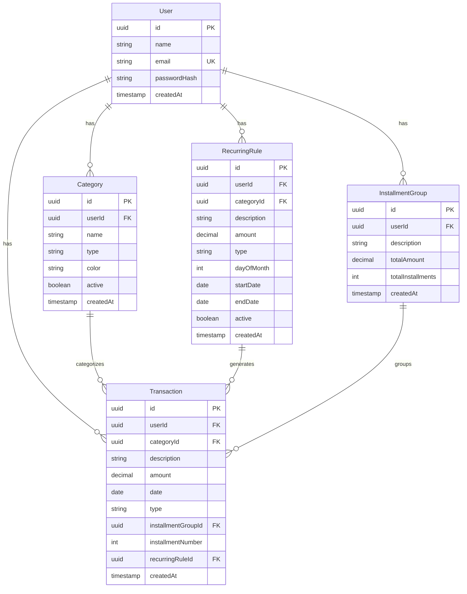

# 🔌 FinControl Backend

API REST desenvolvida com Node.js, TypeScript e Hono para gerenciamento financeiro pessoal.

---

## 📖 Sobre

Backend da aplicação FinControl, responsável por:
- 🔐 Autenticação e autorização com JWT
- 💾 Persistência de dados com PostgreSQL + Prisma
- 📊 Processamento de transações financeiras
- 🔄 Gerenciamento de transações recorrentes
- 📈 Agregação de dados para dashboards

---

## 🚀 Tecnologias

| Tecnologia | Versão | Descrição |
|------------|--------|-----------|
|  | LTS | Runtime JavaScript |
|  | 5.9.3 | Superset tipado |
|  | 4.10.6 | Framework web ultrarrápido |
|  | 7.0.0 | ORM TypeScript-first |
|  | 14 | Banco de dados |
|  | 4.1.12 | Validação de schemas |

---

## 📂 Estrutura do Projeto

```
backend/
├── src/
│   ├── index.ts                 # Entry point da aplicação
│   ├── lib/
│   │   └── prisma.ts            # Cliente Prisma configurado
│   ├── middleware/
│   │   └── auth.ts              # Middleware de autenticação JWT
│   └── routes/
│       ├── auth.ts              # Rotas de autenticação (register, login)
│       ├── categories.ts        # CRUD de categorias
│       ├── transactions.ts      # CRUD de transações
│       ├── recurring.ts         # Transações recorrentes
│       └── dashboard.ts         # Dados agregados para dashboards
│
├── prisma/
│   ├── schema.prisma            # Schema do banco de dados
│   └── migrations/              # Histórico de migrações
│
├── Dockerfile                   # Multi-stage build (dev + prod)
├── package.json
├── tsconfig.json
├── .env.example                 # Exemplo de variáveis de ambiente
└── README.md                    # Este arquivo
```

---

## 🗄️ Modelo de Dados

### Diagrama Entidade-Relacionamento



### Entidades Principais

#### 👤 User
Armazena informações dos usuários cadastrados.

**Campos:**
- `id`: UUID (gerado automaticamente)
- `name`: Nome completo
- `email`: Email único (usado para login)
- `passwordHash`: Senha com hash seguro
- `createdAt`: Data de cadastro

#### 🏷️ Category
Categorias personalizadas por usuário para organizar transações.

**Campos:**
- `type`: `income` (receita) ou `expense` (despesa)
- `color`: Cor hexadecimal para visualização
- `active`: Categoria ativa ou arquivada

**Regra:** Um usuário não pode ter duas categorias com o mesmo nome e tipo.

#### 💰 Transaction
Registro de todas as movimentações financeiras.

**Tipos:**
- **Simples**: Transação única
- **Parcelada**: Vinculada a um `InstallmentGroup`
- **Recorrente**: Gerada automaticamente por uma `RecurringRule`

#### 🔄 RecurringRule
Regras para gerar transações fixas mensais automaticamente.

**Uso:** Aluguel, contas de água/luz, salário, etc.

**Campos importantes:**
- `dayOfMonth`: Dia do mês para gerar (1-31)
- `startDate`: Data de início
- `endDate`: Data de término (opcional)
- `active`: Se está gerando transações

#### 💳 InstallmentGroup
Agrupa transações parceladas de uma compra.

**Exemplo:** Compra de R$ 1.200 em 12x gera 1 grupo e 12 transações.

---

## 🔌 API Endpoints

Todos os endpoints (exceto autenticação) requerem token JWT no header:
```
Authorization: Bearer <token>
```

### 🔐 Autenticação

#### POST `/api/auth/register`
Cria uma nova conta de usuário.

**Request:**
```json
{
  "name": "João Silva",
  "email": "joao@exemplo.com",
  "password": "senha_segura_123"
}
```

**Response:** `201 Created`
```json
{
  "message": "Usuário criado com sucesso",
  "user": {
    "id": "uuid",
    "name": "João Silva",
    "email": "joao@exemplo.com"
  }
}
```

**Erros:**
- `400`: Email já cadastrado
- `400`: Dados inválidos

---

#### POST `/api/auth/login`
Autentica um usuário e retorna token JWT.

**Request:**
```json
{
  "email": "joao@exemplo.com",
  "password": "senha_segura_123"
}
```

**Response:** `200 OK`
```json
{
  "token": "eyJhbGciOiJIUzI1NiIsInR5cCI6IkpXVCJ9...",
  "user": {
    "id": "uuid",
    "name": "João Silva",
    "email": "joao@exemplo.com"
  }
}
```

**Erros:**
- `401`: Credenciais inválidas

---

#### GET `/api/auth/me`
Retorna dados do usuário autenticado.

**Headers:** `Authorization: Bearer <token>`

**Response:** `200 OK`
```json
{
  "id": "uuid",
  "name": "João Silva",
  "email": "joao@exemplo.com",
  "createdAt": "2025-01-15T10:30:00Z"
}
```

---

### 🏷️ Categorias

#### GET `/api/categories`
Lista todas as categorias do usuário.

**Query params (opcionais):**
- `type`: `income` ou `expense`
- `active`: `true` ou `false`

**Response:** `200 OK`
```json
[
  {
    "id": "uuid",
    "name": "Alimentação",
    "type": "expense",
    "color": "#FF6B6B",
    "description": "Gastos com comida",
    "active": true,
    "createdAt": "2025-01-15T10:30:00Z"
  }
]
```

---

#### POST `/api/categories`
Cria uma nova categoria.

**Request:**
```json
{
  "name": "Alimentação",
  "type": "expense",
  "color": "#FF6B6B",
  "description": "Gastos com supermercado e restaurantes"
}
```

**Response:** `201 Created`
```json
{
  "id": "uuid",
  "name": "Alimentação",
  "type": "expense",
  "color": "#FF6B6B",
  "description": "Gastos com supermercado e restaurantes",
  "active": true,
  "createdAt": "2025-01-15T10:30:00Z"
}
```

**Erros:**
- `400`: Categoria com esse nome e tipo já existe

---

#### PUT `/api/categories/:id`
Atualiza uma categoria existente.

**Request:**
```json
{
  "name": "Alimentação e Bebidas",
  "color": "#FF5555",
  "description": "Todos os gastos com comida e bebida"
}
```

**Response:** `200 OK`

---

#### DELETE `/api/categories/:id`
Remove uma categoria.

**Response:** `204 No Content`

**Nota:** Transações vinculadas à categoria terão `categoryId` definido como `null`.

---

### 💰 Transações

#### GET `/api/transactions`
Lista transações do usuário.

**Query params (opcionais):**
- `type`: `income` ou `expense`
- `startDate`: Data inicial (ISO 8601)
- `endDate`: Data final (ISO 8601)
- `categoryId`: UUID da categoria
- `limit`: Número máximo de resultados
- `offset`: Paginação

**Response:** `200 OK`
```json
{
  "transactions": [
    {
      "id": "uuid",
      "description": "Salário",
      "amount": 5000.00,
      "type": "income",
      "date": "2025-11-01",
      "categoryId": "uuid",
      "category": {
        "name": "Trabalho",
        "color": "#4CAF50"
      },
      "installmentNumber": null,
      "recurringRuleId": null,
      "createdAt": "2025-11-01T10:00:00Z"
    }
  ],
  "total": 150
}
```

---

#### POST `/api/transactions`
Cria uma nova transação.

**Request (transação simples):**
```json
{
  "description": "Almoço no restaurante",
  "amount": 45.50,
  "type": "expense",
  "date": "2025-11-27",
  "categoryId": "uuid"
}
```

**Request (transação parcelada):**
```json
{
  "description": "Notebook Dell",
  "amount": 3600.00,
  "type": "expense",
  "date": "2025-11-27",
  "categoryId": "uuid",
  "installments": 12
}
```

**Response:** `201 Created`

---

#### PUT `/api/transactions/:id`
Atualiza uma transação existente.

**Request:**
```json
{
  "description": "Almoço no restaurante (atualizado)",
  "amount": 50.00
}
```

**Response:** `200 OK`

---

#### DELETE `/api/transactions/:id`
Remove uma transação.

**Response:** `204 No Content`

---

#### GET `/api/transactions/installments`
Lista todos os grupos de parcelamentos.

**Response:** `200 OK`
```json
[
  {
    "id": "uuid",
    "description": "Notebook Dell",
    "totalAmount": 3600.00,
    "totalInstallments": 12,
    "paidInstallments": 3,
    "remainingAmount": 2700.00,
    "createdAt": "2025-11-27T10:00:00Z"
  }
]
```

---

### 🔄 Transações Recorrentes

#### GET `/api/recurring`
Lista todas as regras recorrentes.

**Query params (opcionais):**
- `active`: `true` ou `false`
- `type`: `income` ou `expense`

**Response:** `200 OK`
```json
[
  {
    "id": "uuid",
    "description": "Aluguel",
    "amount": 1500.00,
    "type": "expense",
    "dayOfMonth": 10,
    "categoryId": "uuid",
    "category": {
      "name": "Moradia",
      "color": "#9C27B0"
    },
    "startDate": "2025-01-01",
    "endDate": null,
    "active": true,
    "createdAt": "2025-01-01T10:00:00Z"
  }
]
```

---

#### POST `/api/recurring`
Cria uma nova regra recorrente.

**Request:**
```json
{
  "description": "Aluguel",
  "amount": 1500.00,
  "type": "expense",
  "dayOfMonth": 10,
  "categoryId": "uuid",
  "startDate": "2025-01-01",
  "active": true
}
```

**Response:** `201 Created`

---

#### PUT `/api/recurring/:id`
Atualiza uma regra recorrente.

**Request:**
```json
{
  "amount": 1600.00,
  "active": true
}
```

**Response:** `200 OK`

---

#### DELETE `/api/recurring/:id`
Remove uma regra recorrente.

**Response:** `204 No Content`

**Nota:** Transações já geradas não são removidas.

---

#### POST `/api/recurring/generate`
Gera transações do mês atual baseadas nas regras ativas.

**Response:** `200 OK`
```json
{
  "generated": 5,
  "message": "5 transações recorrentes geradas para novembro/2025"
}
```

**Nota:** Transações já geradas no mês não são duplicadas.

---

### 📊 Dashboard

#### GET `/api/dashboard/summary`
Retorna resumo financeiro do mês atual.

**Response:** `200 OK`
```json
{
  "totalIncome": 8500.00,
  "totalExpenses": 6200.00,
  "balance": 2300.00,
  "period": "2025-11",
  "transactionCount": {
    "income": 3,
    "expense": 47
  }
}
```

---

#### GET `/api/dashboard/recent`
Retorna as últimas 10 transações.

**Response:** `200 OK`
```json
[
  {
    "id": "uuid",
    "description": "Supermercado",
    "amount": 250.00,
    "type": "expense",
    "date": "2025-11-27",
    "category": {
      "name": "Alimentação",
      "color": "#FF6B6B"
    }
  }
]
```

---

#### GET `/api/dashboard/upcoming`
Retorna próximas contas a vencer (próximos 7 dias).

**Response:** `200 OK`
```json
[
  {
    "description": "Conta de Luz",
    "amount": 150.00,
    "dueDate": "2025-11-30",
    "category": {
      "name": "Contas",
      "color": "#FFC107"
    }
  }
]
```

---

#### GET `/api/dashboard/category-chart`
Retorna dados agrupados por categoria para gráficos.

**Query params (opcionais):**
- `type`: `income` ou `expense`
- `month`: `YYYY-MM` (padrão: mês atual)

**Response:** `200 OK`
```json
{
  "categories": [
    {
      "name": "Alimentação",
      "total": 1250.00,
      "percentage": 35.5,
      "color": "#FF6B6B",
      "transactionCount": 28
    },
    {
      "name": "Transporte",
      "total": 450.00,
      "percentage": 12.8,
      "color": "#2196F3",
      "transactionCount": 15
    }
  ],
  "total": 3520.00
}
```

---

## ⚙️ Variáveis de Ambiente

Crie um arquivo `.env` na raiz do backend baseado no `.env.example`:

```bash
cp .env.example .env
```

### Configuração

| Variável | Descrição | Obrigatória | Exemplo |
|----------|-----------|-------------|---------|
| `POSTGRES_USER` | Usuário do PostgreSQL | ✅ Sim | `postgres` |
| `POSTGRES_PASSWORD` | Senha do PostgreSQL | ✅ Sim | `sua_senha_segura` |
| `POSTGRES_DB` | Nome do banco de dados | ✅ Sim | `fincontrol` |
| `DATABASE_URL` | URL de conexão completa do Prisma | ✅ Sim | `postgresql://user:pass@db:5432/fincontrol?schema=public` |
| `FRONTEND_URL` | URL do frontend (CORS) | ✅ Sim | `http://localhost:5173` |
| `PORT` | Porta do servidor | ❌ Não | `3001` (padrão) |
| `JWT_SECRET` | Chave secreta para JWT | ✅ Sim | String aleatória (32+ caracteres) |

### ⚠️ Segurança

**Em produção:**
- ✅ Use senhas fortes e únicas
- ✅ Gere `JWT_SECRET` com no mínimo 32 caracteres aleatórios
- ✅ Nunca commite o arquivo `.env` no Git
- ✅ Use variáveis de ambiente do servidor/container

**Gerar JWT_SECRET seguro:**
```bash
node -e "console.log(require('crypto').randomBytes(32).toString('hex'))"
```

---

## 🛠️ Desenvolvimento

### Pré-requisitos

- Node.js 18+ (ou use Docker)
- PostgreSQL 14+ (ou use Docker)

### Instalação Local

```bash
# Instalar dependências
npm install

# Configurar .env
cp .env.example .env
# Edite .env com suas configurações

# Executar migrações
npx prisma migrate deploy

# Modo desenvolvimento (hot reload)
npm run dev
```

### Scripts Disponíveis

```bash
npm run dev      # Servidor com hot reload (tsx watch)
npm run build    # Compilar TypeScript para JavaScript
npm start        # Executar versão compilada (produção)
```

### Prisma

```bash
# Gerar cliente Prisma após mudar schema
npx prisma generate

# Criar nova migração
npx prisma migrate dev --name nome_da_migracao

# Aplicar migrações (produção)
npx prisma migrate deploy

# Abrir Prisma Studio (GUI para ver banco)
npx prisma studio
```

---

## 🐳 Docker

O backend possui Dockerfile com multi-stage build:

**Stage `dev`:** Hot reload com tsx  
**Stage `production`:** Build otimizado

### Executar com Docker Compose

```bash
# Da raiz do projeto
docker compose up backend
```

### Build da imagem

```bash
# Desenvolvimento
docker build --target dev -t fincontrol-backend:dev .

# Produção
docker build --target production -t fincontrol-backend:prod .
```

---

## 🧪 Testando a API

### Com cURL

```bash
# Registrar usuário
curl -X POST http://localhost:3001/api/auth/register \
  -H "Content-Type: application/json" \
  -d '{"name":"João","email":"joao@test.com","password":"123456"}'

# Login
curl -X POST http://localhost:3001/api/auth/login \
  -H "Content-Type: application/json" \
  -d '{"email":"joao@test.com","password":"123456"}'

# Criar categoria (com token)
curl -X POST http://localhost:3001/api/categories \
  -H "Content-Type: application/json" \
  -H "Authorization: Bearer SEU_TOKEN_AQUI" \
  -d '{"name":"Alimentação","type":"expense","color":"#FF6B6B"}'
```

### Com Postman/Insomnia

Importe os endpoints ou use a collection disponível em `/docs`.

---

## 🤝 Contribuindo

Para adicionar novas funcionalidades:

1. Crie uma nova rota em `src/routes/`
2. Adicione validação Zod se necessário
3. Use o middleware `auth` para rotas protegidas
4. Documente o endpoint neste README
5. Teste com cURL ou Postman

---

## 📝 Notas de Desenvolvimento

### Estrutura de Rotas

Todas as rotas seguem o padrão RESTful:
- `GET`: Listar/Obter
- `POST`: Criar
- `PUT/PATCH`: Atualizar
- `DELETE`: Remover

### Autenticação

O middleware `auth.ts` extrai o JWT do header e adiciona `userId` ao contexto do Hono:

```typescript
c.get('userId') // UUID do usuário autenticado
```

### Validação

Usando Zod para validar payloads:

```typescript
import { z } from 'zod';
import { zValidator } from '@hono/zod-validator';

const schema = z.object({
  name: z.string().min(3),
  amount: z.number().positive()
});

app.post('/endpoint', zValidator('json', schema), async (c) => {
  const validated = c.req.valid('json');
  // ...
});
```

---

[⬆ Voltar ao README principal](../README.md)
